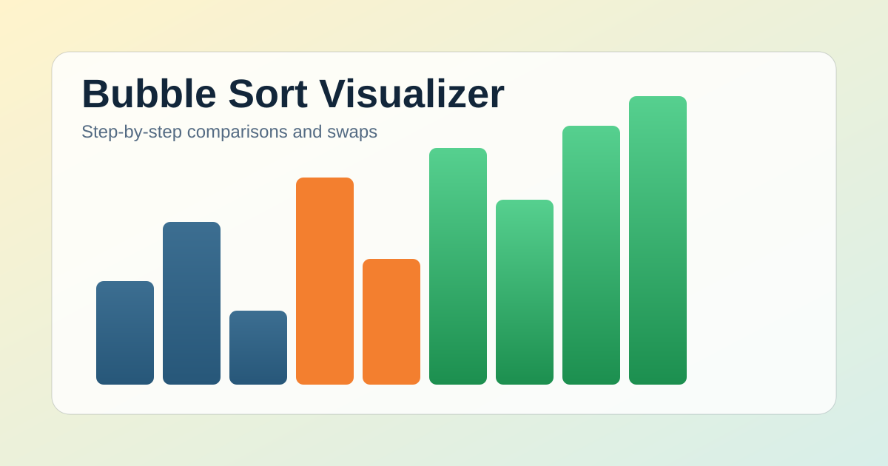

# Bubble Sort Visualizer

Interactive Bubble Sort project built with HTML, CSS, and JavaScript.

This app visualizes each comparison and swap so the algorithm is easier to understand, explain, and demo.

## Live Project Goal

Build a clear, beginner-friendly, and GitHub-ready sorting visualizer that demonstrates:

- algorithm behavior step by step
- optimization with early-stop logic
- practical DOM updates and state management

## Features

- Custom input array (comma-separated numbers)
- Random array generation
- Adjustable animation speed
- Start, Pause/Resume, Step, and Reset controls
- Live metrics: pass count, comparison count, and swap count
- Color-coded bars for compared and sorted sections
- Early-stop optimization (best-case O(n))
- Responsive design for desktop and mobile

## Tech Stack

- HTML5
- CSS3 (custom properties, responsive layout, motion)
- Vanilla JavaScript (no frameworks)

## Project Structure

```text
bubble-sort-visualizer/
├── index.html
├── style.css
├── script.js
├── assets/
│   └── preview.svg
├── README.md
├── project-summary.md
├── LICENSE
└── .gitignore
```

## Screenshot



## How Bubble Sort Works

Bubble Sort compares adjacent elements and swaps them when they are in the wrong order.

For example:

```text
[5, 3, 8, 2]
```

Compare first pair:

```text
5 > 3  => swap
```

Array becomes:

```text
[3, 5, 8, 2]
```

After each pass, the largest unsorted value "bubbles" to the end.
If one full pass makes no swaps, the array is already sorted and the algorithm exits early.

## Algorithm (Reference)

```javascript
function bubbleSort(arr) {
  for (let pass = 0; pass < arr.length - 1; pass++) {
    let swapped = false;

    for (let i = 0; i < arr.length - 1 - pass; i++) {
      if (arr[i] > arr[i + 1]) {
        [arr[i], arr[i + 1]] = [arr[i + 1], arr[i]];
        swapped = true;
      }
    }

    if (!swapped) break;
  }

  return arr;
}
```

## Complexity

- Worst case: O(n^2)
- Average case: O(n^2)
- Best case: O(n) with early-stop optimization
- Space complexity: O(1)

## Run Locally

1. Download or clone the repository.
2. Open the folder.
3. Open index.html in any modern browser.
4. Load custom values or generate a random array.
5. Press Start to run the visualization.

No dependencies or build tools are required.

## Suggested GitHub Topics

sorting-algorithm, bubble-sort, algorithm-visualizer, javascript, html-css-js, dsa

## License

This project is licensed under the MIT License. See the LICENSE file for details.

## Author

Deepika Sharma
